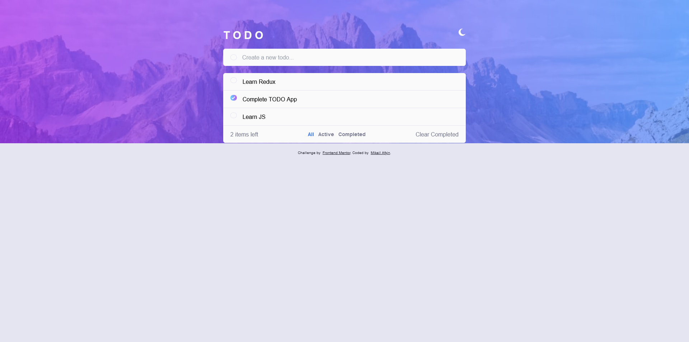
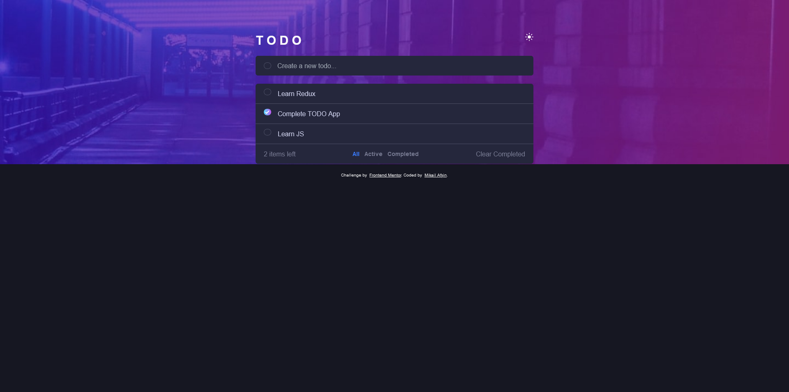

# Frontend Mentor - Todo app solution

This is a solution to the [Todo app challenge on Frontend Mentor](https://www.frontendmentor.io/challenges/todo-app-Su1_KokOW).

## Table of contents

-   [Overview](#overview)
    -   [The challenge](#the-challenge)
    -   [Screenshot](#screenshot)
    -   [Links](#links)
-   [My process](#my-process)
    -   [Built with](#built-with)
    -   [What I learned](#what-i-learned)
    -   [Continued development](#continued-development)
-   [Author](#author)

## Overview

### The challenge

Users should be able to:

-   View the optimal layout for the app depending on their device's screen size
-   See hover states for all interactive elements on the page
-   Add new todos to the list
-   Mark todos as complete
-   Delete todos from the list
-   Filter by all/active/complete todos
-   Clear all completed todos
-   Toggle light and dark mode

### Screenshot

**Desktop Light**


**Desktop Dark**


### Links

-   Solution URL: [GitHub]()
-   Live Site URL: [Vercel]()

## My process

### Built with

-   [React](https://reactjs.org/) - JS library
-   [Redux Toolkit](https://redux-toolkit.js.org/) - React library
-   [TailwindCss](https://tailwindcss.com/) - Css framework
-   [Toastify](https://fkhadra.github.io/react-toastify/introduction/) - React notifications package
-   Mobile-first workflow

### What I learned

In this project I focused on improving my redux toolkit skills in general and in this project I learned how to use the redux toolkit more effectively.

**todoSlice.js**

```js
import { createSlice } from "@reduxjs/toolkit";

const loadStateFromLocalStorage = () => JSON.parse(localStorage.getItem("todoState"));
const saveStateToLocalStorage = (state) => localStorage.setItem("todoState", JSON.stringify(state));

const initialState = loadStateFromLocalStorage() || {
    todos: [],
    filter: "all",
};

const todoSlice = createSlice({
    name: "todo",
    initialState,
    reducers: {
        addTodo: (state, action) => {
            state.todos = [action.payload, ...state.todos];
            saveStateToLocalStorage(state);
        },
        deleteTodo: (state, action) => {
            state.todos = state.todos.filter((todo) => todo.id !== action.payload);
            saveStateToLocalStorage(state);
        },
        clearCompleted: (state) => {
            state.todos = state.todos.filter((todo) => todo.completed === false);
            saveStateToLocalStorage(state);
        },
        toggleTodo: (state, action) => {
            state.todos = state.todos.map((todo) =>
                todo.id === action.payload ? { ...todo, completed: !todo.completed } : todo
            );
            saveStateToLocalStorage(state);
        },
        setFilter: (state, action) => {
            state.filter = action.payload;
            saveStateToLocalStorage(state);
        },
    },
});

export const { addTodo, deleteTodo, clearCompleted, toggleTodo, setFilter } = todoSlice.actions;
export default todoSlice.reducer;
};
```

### Continued development

In future projects, I would like to practice all the competencies I learned while developing this challenge over and over again and have more control over the competencies.

## Author

-   Frontend Mentor - [@mikailafsin](https://www.frontendmentor.io/profile/mikailafsin)
-   Instagram - [@mikail.afsin](https://www.instagram.com/mikail.afsin)
